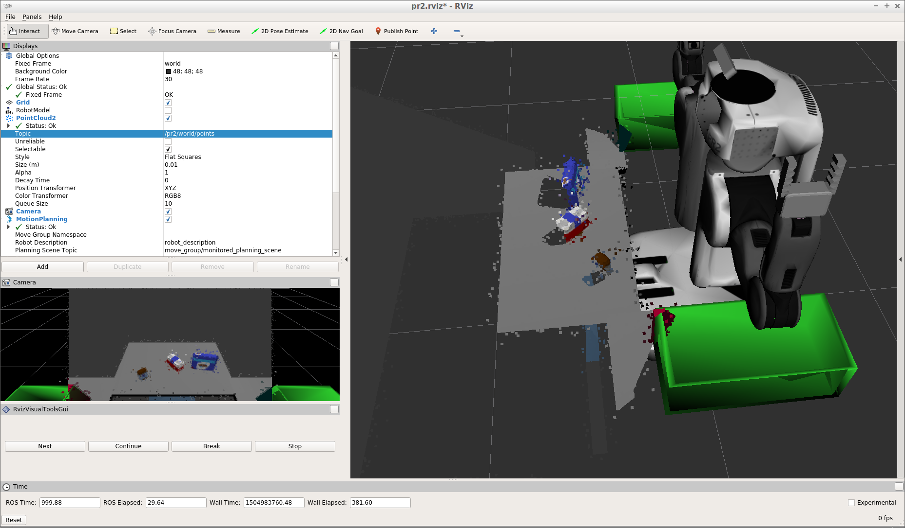
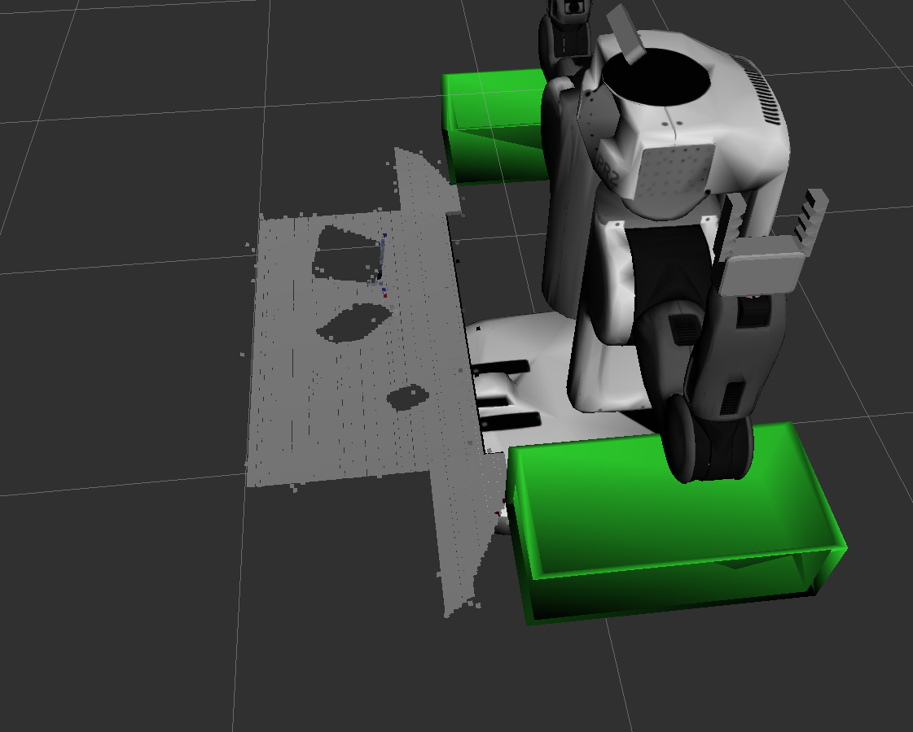
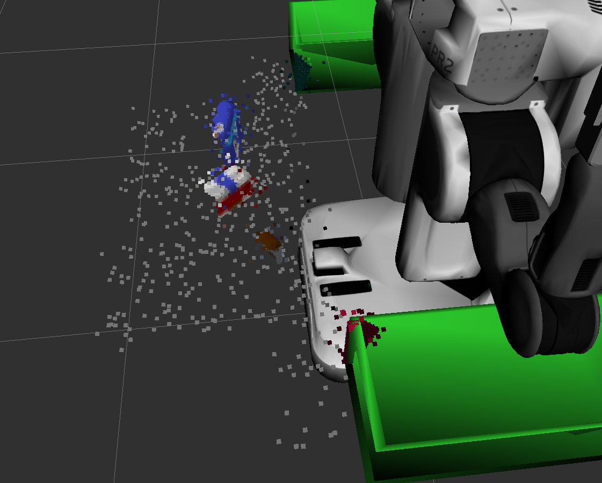
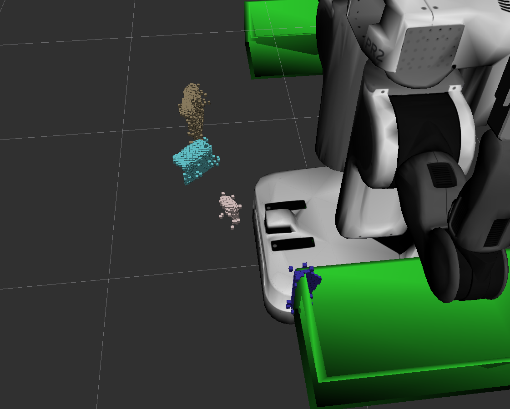
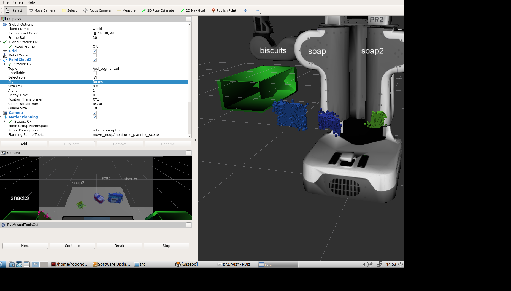

[](https://www.udacity.com/robotics)

# Project Setup
For this setup, catkin_ws is the name of active ROS Workspace, if your workspace name is different, change the commands accordingly
If you do not have an active ROS workspace, you can create one by:

```sh
$ mkdir -p ~/catkin_ws/src
$ cd ~/catkin_ws/
$ catkin_make
```

Now that you have a workspace, clone or download this repo into the src directory of your workspace:
```sh
$ cd ~/catkin_ws/src
$ git clone https://github.com/udacity/RoboND-Perception-Project.git
```
### Note: If you have the Kinematics Pick and Place project in the same ROS Workspace as this project, please remove the 'gazebo_grasp_plugin' directory from the `RoboND-Perception-Project/` directory otherwise ignore this note. 

Now install missing dependencies using rosdep install:
```sh
$ cd ~/catkin_ws
$ rosdep install --from-paths src --ignore-src --rosdistro=kinetic -y
```
Build the project:
```sh
$ cd ~/catkin_ws
$ catkin_make
```
Add following to your .bashrc file
```
export GAZEBO_MODEL_PATH=~/catkin_ws/src/RoboND-Perception-Project/pr2_robot/models:$GAZEBO_MODEL_PATH
```

If you haven’t already, following line can be added to your .bashrc to auto-source all new terminals
```
source ~/catkin_ws/devel/setup.bash
```

To run the demo:
```sh
$ cd ~/catkin_ws/src/RoboND-Perception-Project/pr2_robot/scripts
$ chmod u+x pr2_safe_spawner.sh
$ ./pr2_safe_spawner.sh
```


Once Gazebo is up and running, make sure you see following in the gazebo world:
- Robot

- Table arrangement

- Three target objects on the table

- Dropboxes on either sides of the robot


If any of these items are missing, please report as an issue on [the waffle board](https://waffle.io/udacity/robotics-nanodegree-issues).

In your RViz window, you should see the robot and a partial collision map displayed:


Proceed through the demo by pressing the ‘Next’ button on the RViz window when a prompt appears in your active terminal

The demo ends when the robot has successfully picked and placed all objects into respective dropboxes (though sometimes the robot gets excited and throws objects across the room!)

Close all active terminal windows using **ctrl+c** before restarting the demo.

You can launch the project scenario like this:
```sh
$ roslaunch pr2_robot pick_place_project.launch
```

# Vision Pipeline
Object recognition in this project is based on a point cloud output of a RGBD camera. The script `main.py` in `pr2_robot/scripts/` contains most of the code implementing the pipeline. The RGBD cloud point data is received by subscribing to `/pr2/world/points` topic. Here is an example of a cloud point sample visualized in RViz:


Following sections elaborate on each step in the pipeline.

## Filtering and Isolation
The scene contains a table and objects, therefore one of the first steps in the pipeline is to separate the table from the objects since we are interested in the objects only. This separation is done in a function `ransac()` using RANSAC plane fitting and filtering out the inliers as follows:
```
def ransac(cloud):
  # Create the segmentation object
  seg = cloud.make_segmenter()
  
  # Set the model you wish to fit 
  seg.set_model_type(pcl.SACMODEL_PLANE)
  seg.set_method_type(pcl.SAC_RANSAC)
  
  # Max distance for a point to be considered fitting the model
  # Experiment with different values for max_distance 
  # for segmenting the table
  max_distance = 0.01
  seg.set_distance_threshold(max_distance)
  
  # Call the segment function to obtain set of inlier indices and model coefficients
  inliers, coefficients = seg.segment()

  # Extract inliers
  table   = cloud.extract(inliers, negative=False)
  objects = cloud.extract(inliers, negative=True)
  
  return table, objects
```
The resulting cloud points after separation:



## Euclidian Clustering
The previous step resulted in a point cloud containing all of the objects. The goal of the clustering step is to separate the objects such as later all points that belong to one specific objects can be retrieved. To achieve this, we use Euclidian Clustering where spatial distance between points is used to determine whether two points belong to the same object. The step is performed in `segmentation()` function:
```
def segmentation(cloud): 
  white_cloud = XYZRGB_to_XYZ(cloud)
  tree = white_cloud.make_kdtree()
  
  # Create a cluster extraction object
  ec = white_cloud.make_EuclideanClusterExtraction()
  # Set tolerances for distance threshold 
  # as well as minimum and maximum cluster size (in points)
  ec.set_ClusterTolerance(0.02)
  ec.set_MinClusterSize(100)
  ec.set_MaxClusterSize(2000)
  # Search the k-d tree for clusters
  ec.set_SearchMethod(tree)
  # Extract indices for each of the discovered clusters
  cluster_indices = ec.Extract()

  return cluster_indices, white_cloud
```
The resulting segments are consequently visualized using different color for each object in Rviz:


## Object Recognition
Object recognition is done using Support Vector Machine classifier (SVM) that was prior trained on each one of the object models by sampling cloud points in different poses. Following are more details about training and classification.

### Features 
There are two types of features that are extracted from the cloud point of an object:
* histograms of colors - each one of the HSV channels produces a 32-bin histogram of channel values ranging 0-256 
* histogram of normals - for each one of the HSV channels normals to the object's surface are calculated and produce a 32-bin histogram of channel values ranging 0-256

In both cases the histograms are normalized to sum to 1 and concatenated to create a feature vector. The code responsible for this extraction is in `main.py` under the function `extract_features`. This function uses helper function in the file `features.py`.
```
    # Compute histograms
    ch1_hist = np.histogram(channel_1_vals, bins=32, range=(0, 256))
    ch2_hist = np.histogram(channel_2_vals, bins=32, range=(0, 256))
    ch3_hist = np.histogram(channel_3_vals, bins=32, range=(0, 256))

    # Concatenate and normalize the histograms
    hist_features = np.concatenate((ch1_hist[0], ch2_hist[0], ch3_hist[0])).astype(np.float64)
    norm_features = hist_features / np.sum(hist_features)
```

### Model Training
To train the model 100 samples of each class were collected as point cloud data from RGBD camera, after spawning a model of the object in random position in Gazebo. The classifier is SVM (Support Vector Machine) with linear kernel and it was trained on a training set comprising on a random 80% of the data. The rest is test data on which the accuracy tests were performed. The accuracy on the test set was above 90%. The code responsible for training the classifier is located in `train_svm.py`.


### Inference
Finally, each object's point cloud is extracted with the help of segmentation output is passed to the classifier (after extracting features as described earlier). The classifier outputs probablities for each one of the classes with respect to the input point cloud. The code extracts the label of the class with highest probabilities and displays in Rviz while also building a list of detected objects as follows:
```
def object_recognition(cluster_indices, cloud_objects, white_cloud):
    detected_objects = []
    for index, pts_list in enumerate(cluster_indices):
        # Grab the points for the cluster from the extracted outliers (cloud_objects)
        pcl_cluster = cloud_objects.extract(pts_list)
        # convert the cluster from pcl to ROS using helper function
        ros_cloud = pcl_to_ros(pcl_cluster)
        
        # Extract histogram features
        # complete this step just as is covered in capture_features.py
        features = extract_features(ros_cloud)
    
        # Make the prediction, retrieve the label for the result
        # and add it to detected_objects_labels list
        prediction = clf.predict(scaler.transform(features.reshape(1,-1)))
        label = encoder.inverse_transform(prediction)[0]
        #detected_objects_list.append(label)
        
        # Publish a label into RViz
        label_pos = list(white_cloud[pts_list[0]])
        label_pos[2] += .4
        object_markers_pub.publish(make_label(label,label_pos, index))
    
        # Add the detected object to the list of detected objects.
        do = DetectedObject()
        do.label = label
        do.cloud = ros_cloud
        detected_objects.append(do)
    
    return detected_objects
```
Finally, the resulting image after executing the pipeline contains labels near each object that was recognized:

 

